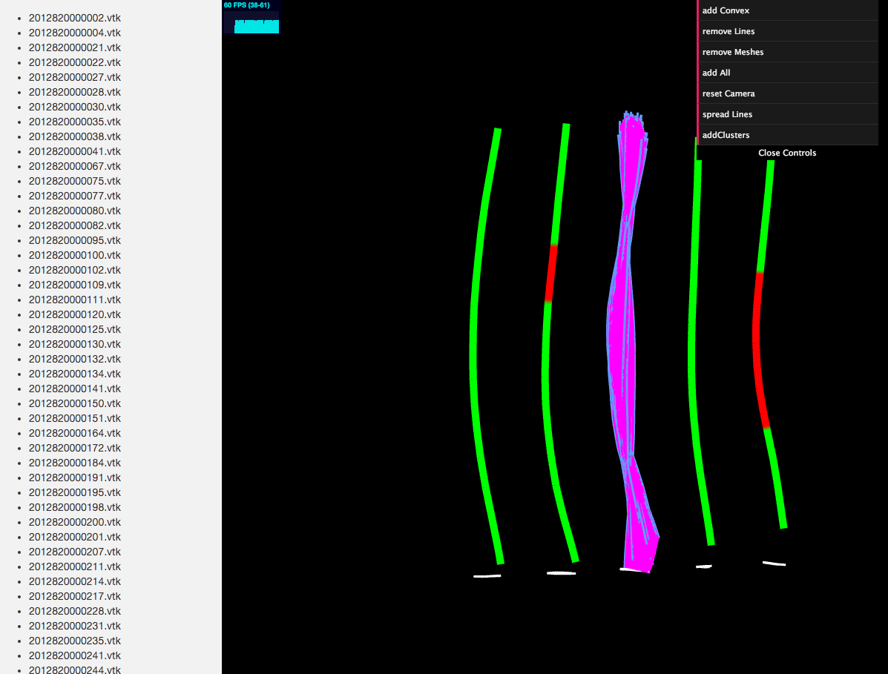

# THREE.js Playground

Purpose of this project is to provide a reimplementation of a VTK-spine data set visualization of the [VMV'14 Paper](http://dx.doi.org/10.2312/PE.VMV.VMV13.121-128) in `WebGL`. To set everything up, run `make`.

The image is from the `convex` branch of David.